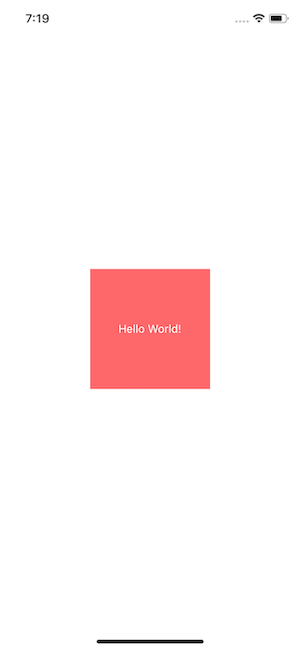

# react-native-easy-layout-view

It is a simple and intuitive way to implement templates commonly used in applications, they are a good starting point to build screen designs even without knowing the basic rules of flex-box.

## Demo
Run the [example app](https://expo.io/@deita0x/react-native-easy-layout-view) with [Expo](https://expo.io/) to see it in action.

The source code for the examples are under the [/example](/example) folder.

## Features
- Pure JS.
- Supports every prop that the standard React Native `View` component supports.
- Very small.

## Supported modifiers
- Alignment: row, column, spread, centerH, centerV, left, right, top, bottom
- Flex: flex-[value]
- Margin: margin-[value], marginL-[value], marginR-[value], marginT-[value], marginB-[value]
- Padding: padding-[value], paddingL-[value], paddingR-[value], paddingT-[value], paddingB-[value]
- Width: width-[value]
- Height: height-[value]

## Examples

If we want a box centered both horizontally and vertically as in the image.




It is enough to indicate that it will occupy all the available space with `flex` and that it will also be centered with `center`
```
<View useSafeArea flex center style={{ backgroundColor: '#FFF' }}>
  <View center width-150 height-150 style={{ backgroundColor: '#FF686B' }}>
    <Text style={{ color: '#FFF' }}>Hello World!</Text>
  </View>
</View>
```
instead of:
```
<SafeAreaView style={{ flex: 1, justifyContent: 'center', alignItems: 'center', backgroundColor: '#FFF' }}>
  <View style={{ justifyContent: 'center', alignItems: 'center', width: 150, height: 150, backgroundColor: '#FF686B' }}>
    <Text style={{ color: '#FFF' }}>Hello World!</Text>
  </View>
</SafeAreaView>
```

Another common aligments:
- Center
```
<View flex center>
  ...
</View>
```
Equals to:
```
<View  style={{ flex:1 , justifyContent: 'center', alignItems: 'center' }}>
  ...
</View>
```

- Left
```
<View flex left>
  ...
</View>
```
Equals to:
```
<View  style={{flex: 1, alignItems: "flex-start"}}>
  ...
</View>
```

TODO: add more examples

- Row + Bottom + Space Between
```
<View flex row bottom spread>
  ...
</View>
```
Equals to:
```
<View  style={{flex: 1, flexDirection: "row", justifyContent: "space-between", alignItems: "flex-end"}}>
  ...
</View>
```

